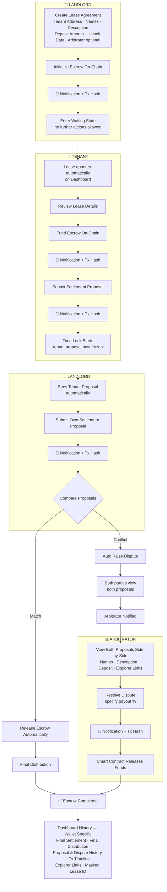
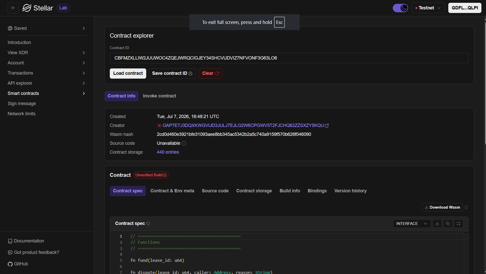
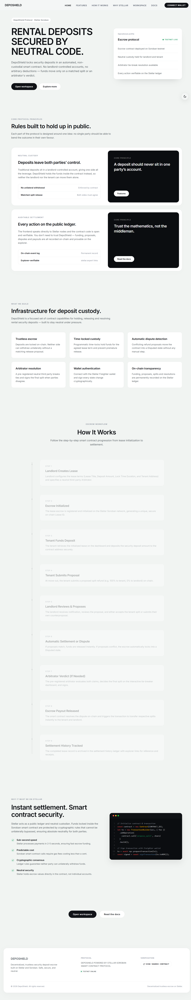
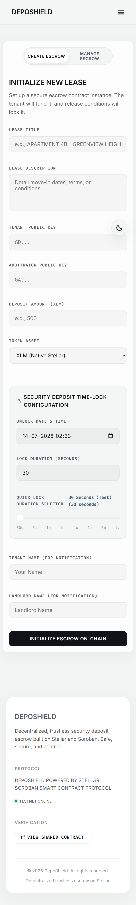
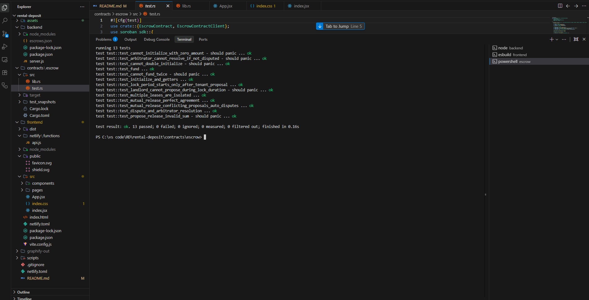
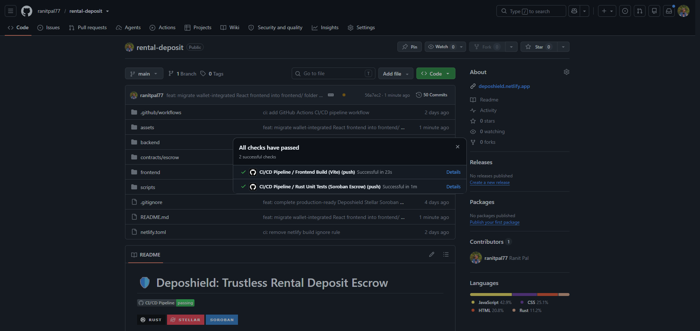
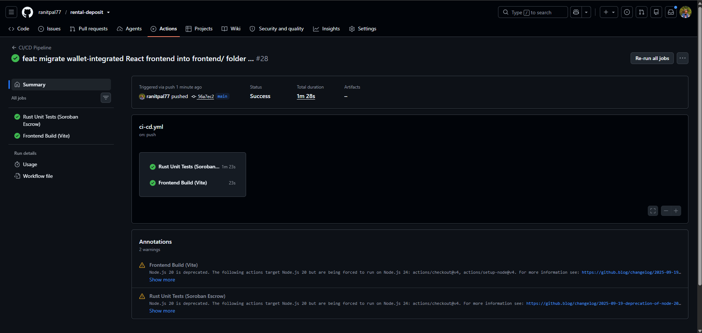
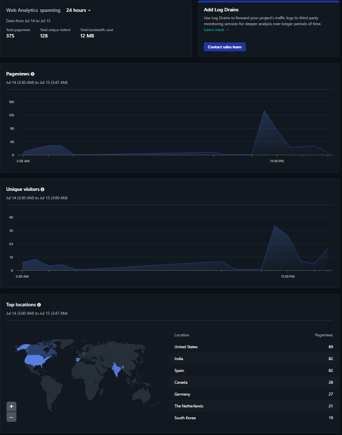

# 🛡️ Deposhield — Trustless Rental Deposit Escrow

[](https://github.com/ranitpal77/rental-deposit/actions/workflows/ci-cd.yml)


---

## Table of Contents

1.  [The Problem](#-the-problem)
2.  [How It Works](#-how-it-works)
3.  [Features](#-features)
4.  [The Stellar
    Advantage](#-the-stellar-advantage-beyond-hand-to-hand-cash)
5.  [Architecture](#-architecture)
    -   [Escrow Flow](#escrow-flow)
    -   [Development Pipeline](#development-pipeline-plan)
6.  [Tech Stack](#-tech-stack)
7.  [Setup & Local Development](#-setup--local-development)
8.  [End-to-End Walkthrough](#-end-to-end-walkthrough)
9.  [Project Structure](#-project-structure)
10. [User Feedback &
    Responses](#-user-feedback--responses-user-onboarding)
11. [Feedback Iteration Tracker](#-feedback-iteration-tracker)
12. [On-Chain Info](#-on-chain-info)
13. [Screenshots](#-screenshots)
14. [Demo Videos](#demo-videos)
15. [Future Enhancements](#-future-enhancements)


---

## 🌍 The Problem

In informal and emerging rental markets across India, Latin America, and Africa, security deposits represent 1–3 months of rent. Two broken systems exist today:

- **Cash to landlord directly** — leads to unfair withholding at move-out with no recourse
- **Bank escrow** — slow, expensive, and unavailable to most renters

Deposhield replaces both with a Soroban smart contract that nobody controls and nobody can cheat.

**Why Stellar?**
- Each lease maps to an independent, lightweight contract — scales to thousands of concurrent escrows with no bottleneck
- Sub-cent transaction fees make trustless escrow accessible to renters of any income level
- Mutual release logic layered with a neutral arbitrator backstop ensures funds are never permanently locked

---

## 🚀 How It Works

| Step | Action |
|---|---|
| 1 | 👤 **Landlord** creates the lease and initializes escrow on-chain |
| 2 | 👤 **Tenant** reviews the lease, funds the escrow, and submits a settlement proposal |
| 3 | 👤 **Landlord** submits their own proposal |
| 4 | ⛓️ Contract compares both — **match** → funds auto-release, **conflict** → dispute auto-raised |
| 5 | ⚖️ **Arbitrator** reviews both proposals and resolves the dispute with a payout split |
| 6 | ✅ Escrow completes — full history available on each party's dashboard |

The deposit always lives at the **contract address**. The arbitrator never touches the funds — they only sign an instruction, and the contract enforces the split.

> See the [Escrow Flow](#escrow-flow) diagram below for the full branching logic, including waiting states and permission boundaries.

---

## ✨ Features

- **Fully Permissionless** — the core escrow contract has no platform operator. Funds are locked by code and released only under strict matching rules or arbitrator resolution.
- **Sequential Multi-Party Approval** — both parties propose splits independently. When proposals match on-chain, the contract releases funds automatically. No complex multi-signature browser coordination required.
- **Arbitration Backstop** — a neutral third-party arbitrator (e.g. a verified inspector or housing authority) acts as a cryptographic tie-breaker in disputed cases.
- **Glassmorphic UI** — dark-themed (#0A0A0B), radial dot-grid texture, monospace typography, and mobile-responsive layout.
- **Clickable Transaction Links** — every notification includes a direct link to the transaction on Stellar Expert for instant on-chain verification.

---

## 📖 The Stellar Advantage: Beyond Hand-to-Hand Cash
**Deposhield** is a trustless, decentralized security deposit escrow platform built on the Stellar network using Soroban smart contracts. In informal or emerging rental markets across India, Latin America, and Africa, security deposits represent 1 to 3 months' rent. Handing cash directly to landlords frequently leads to unfair withholding at move-out, while traditional bank escrows are slow, expensive, or unavailable. 

By leveraging Stellar's protocol-level primitives and Soroban's smart contracting, Deposhield provides:
- **🌍 Scalable Parallel Escrows:** Each lease maps to an independent, lightweight contract deployment, eliminating single-party bottleneck risks and scaling to thousands of concurrent agreements.
- **⚡ Fractional Transaction Costs:** Emerging market renters can establish trustless escrows for fractions of a cent, making cryptographic security accessible to anyone.
- **🤝 Cryptographic Dispute Mitigation:** Mutual release logic layers with neutral arbitrator tie-breaker backstops to prevent asset locks, moving trust from humans to code.

---

## 🏗️ Architecture

### Escrow Flow



**Explorer Transaction Timeline**

| # | Event |
|---|---|
| 1 | Initialize Escrow |
| 2 | Tenant Funds Escrow |
| 3 | Tenant Proposal |
| 4 | Landlord Proposal |
| 5 | Resolve Dispute *(only if an arbitrator exists)* |
| 6 | Release Funds |

**Role Permissions**

| Role | Can Do | Cannot Do |
|---|---|---|
| **Landlord** | Create lease · Initialize escrow · Submit proposal | Act after initialization until tenant submits a proposal |
| **Tenant** | Fund escrow · Submit proposal | Modify proposal after submission |
| **Arbitrator** | View both proposals & names · Resolve dispute · Submit final payout split | Act unless a dispute has been raised |

---

### Development Pipeline (Plan)

```mermaid
flowchart LR
    P1[Phase 1<br/>Foundation & Design] --> P2[Phase 2<br/>Soroban Contract]
    P2 --> P3[Phase 3<br/>Unit Testing]
    P3 --> P4[Phase 4<br/>Backend Service]
    P4 --> P5[Phase 5<br/>Frontend Dashboard]
    P5 --> P6[Phase 6<br/>Wallet & RPC Integration]
    P6 --> P7[Phase 7<br/>Arbitration Module]
    P7 --> P8[Phase 8<br/>CI/CD & Audit]
    P8 --> P9[Phase 9<br/>Testnet Deployment]
    P9 --> P10[Phase 10<br/>Iteration & Mainnet]
```



---

## 🛠️ Tech Stack

| Layer | Technology |
|---|---|
| Smart Contract | Rust, Soroban SDK v25 |
| Network | Stellar Testnet |
| Frontend | React, Vite, Vanilla CSS |
| Wallet | `@stellar/freighter-api` (latest) |
| Blockchain SDK | `@stellar/stellar-sdk` (latest) |
| Backend | Node.js, Express |

---

## ⚙️ Setup & Local Development

### Prerequisites

Make sure the following are installed before you begin:

- **Node.js** v18.0.0 or higher
- **Rust & Cargo**
- **Rust WASM target** — `rustup target add wasm32-unknown-unknown`
- **Stellar CLI** v21.0.0 or higher — `cargo install --locked stellar-cli --features opt`
- **Freighter Wallet** browser extension — [freighter.app](https://www.freighter.app/)

---

### Step 1 — Freighter Wallet Setup

To test the full multi-party flow (Tenant ↔ Landlord ↔ Arbitrator), create three separate accounts in Freighter:

1. Open Freighter → Settings → Network → switch to **Testnet**
2. Create three accounts:
   - **Account 1:** Tenant (e.g. `GD7H...`)
   - **Account 2:** Landlord (e.g. `GB54...`)
   - **Account 3:** Arbitrator (e.g. `GAAR...`)
3. Fund all three via the **Fund** button in Freighter or via [Stellar Laboratory Friendbot](https://lab.stellar.org/r/testnet/create-account)

---

### Step 2 — Compile & Test Smart Contracts

```bash
# Run all 9 unit tests
cd contracts/escrow
cargo test

# Build the optimized WASM binary (run from workspace root)
node scripts/deploy.js
```

---

### Step 3 — Deploy Contract to Testnet

```bash
stellar contract deploy \
  --wasm contracts/escrow/target/wasm32-unknown-unknown/release/escrow.wasm \
  --source <YOUR_STELLAR_SECRET_KEY> \
  --network testnet
```

Save the **Contract ID** from the output — you will need it in the frontend dashboard.

---

### Step 4 — Start the Services

Run backend and frontend in two separate terminals:

```bash
# Terminal 1 — Backend (runs at http://localhost:5000)
cd backend
npm install
npm start

# Terminal 2 — Frontend (runs at http://localhost:3000)
cd frontend
npm install
npm run dev
```

---

## 🔄 End-to-End Walkthrough

Open `http://localhost:3000` → click **Connect Wallet** → authorize Freighter.

### Core Setup (Required for Both Examples)

1. **Initialize Lease** *(as Tenant — Account 1)*
   - Go to **Create Escrow**
   - Enter a lease title, description, Landlord address (Account 2), Arbitrator address (Account 3), and deposit amount (e.g. `100 XLM`)
   - Click **INITIALIZE ESCROW ON-CHAIN** and sign in Freighter
   - Copy the **Lease ID** from the success notification (e.g. `8172930419203810`)

2. **Fund Escrow** *(as Tenant — Account 1)*
   - Go to **Manage Escrow** → paste the Lease ID → click **LOAD**
   - Click **FUND ESCROW NOW** and approve in Freighter
   - Status changes to `ACTIVE / LOCKED`

---

### Example 1 — Mutual Release (No Dispute)

*Both parties agree on the split. No arbitrator needed.*

1. **Tenant proposes split** — drag slider to `75 XLM → Tenant / 25 XLM → Landlord`, submit and sign
2. **Switch to Account 2** in Freighter → reconnect wallet → load the same Lease ID
3. The interface shows the tenant's proposal and auto-snaps the slider to `75/25`
4. **Landlord confirms** — leave slider at `75/25`, submit and sign
5. **Result** — contract detects matching proposals, instantly pays out `75 XLM → Account 1` and `25 XLM → Account 2`, status becomes `RELEASED / RESOLVED`

---

### Example 2 — Disputed Settlement (Arbitrator Resolves)

*Parties cannot agree. Arbitrator steps in.*

1. Complete the Core Setup with a fresh `100 XLM` escrow
2. **Tenant proposes** `90/10` → **Landlord counter-proposes** `30/70` → conflict is detected, sliders lock, red warning banner appears
3. Either party clicks **RAISE DISPUTE**, enters a reason (e.g. *"Landlord claiming damages that do not exist"*) → status locks to `DISPUTED`
4. **Switch to Account 3** in Freighter → reconnect → load the Lease ID
5. The Arbitrator-only panel appears showing both proposals and the dispute reason
6. Arbitrator sets final split (e.g. `60/40`) → clicks **EXECUTE ARBITRATOR RESOLUTION** → signs
7. **Result** — `60 XLM → Account 1`, `40 XLM → Account 2`, escrow resolved

---

## 📂 Project Structure

```
rental-deposit/
├── contracts/
│   └── escrow/
│       ├── src/
│       │   ├── lib.rs          # Escrow contract logic
│       │   └── test.rs         # Unit tests
│       └── Cargo.toml
├── frontend/
│   ├── index.html
│   ├── vite.config.js
│   ├── package.json
│   └── src/
│       ├── App.jsx             # Main application and layout logic
│       ├── index.jsx           # React mount point
│       ├── index.css           # Glassmorphic global stylesheet
│       ├── components/
│       │   └── ....            # UI component blocks
│       └── pages/
│           └── ....            # Routed application views
├── backend/
│   ├── server.js               # Express metadata coordinator
│   └── package.json
├── scripts/
│   └── deploy.js               # WASM compile helper
├── assets/
│   └── logo.png
└── README.md
```

---

## 📝 User Feedback & Responses (User Onbording)
- [User Feedback Google Form](https://forms.gle/7xPVtErjEJQQMDcw6)
- [User Responses](https://docs.google.com/spreadsheets/d/1f_zYJWeQhZJD-14bfmcK6Pbhmi8SlrjJbWZywKxbZ1Y/edit?resourcekey=&gid=267224706#gid=267224706)
- Google Sheets -> [Feedback Iteration Tracker](https://docs.google.com/spreadsheets/d/1f_zYJWeQhZJD-14bfmcK6Pbhmi8SlrjJbWZywKxbZ1Y/edit?resourcekey=&gid=1774659193#gid=1774659193) 

---

## 📋 Feedback Iteration Tracker

Below is a summary of user feedback and requested enhancements integrated during development, tracked by their corresponding on-chain iteration commits:

All user feedback was collected via a [Google Form](https://forms.gle/1s3Abvi6QEcS1uqa8) and tracked with on-chain iteration commits.

<table>
  <thead>
    <tr>
      <th align="left">Feedback Summary</th>
      <th align="center">Feedback Iteration<br>(Commit Links)</th>
    </tr>
  </thead>
  <tbody>
    <tr>
      <td>Restrict lease creation permissions so that only the landlord can create the lease agreement.</td>
      <td align="center"><a href="https://github.com/ranitpal77/rental-deposit/commit/1f04723380203c6160c3251516796230fdcfc367">1f04723</a></td>
    </tr>
    <tr>
      <td>Lock escrow funds for the entire contract duration, mirroring real-world rental agreements.</td>
      <td align="center"><a href="https://github.com/ranitpal77/rental-deposit/commit/fd979d4ddc1db90d12428da2869a19db2dea8677">fd979d4</a></td>
    </tr>
    <tr>
      <td>Automatically raise a dispute if the landlord rejects the other party's proposal and submits a counterproposal instead.</td>
        <td align="center" rowspan="2" valign="middle">
          <a href="https://github.com/ranitpal77/rental-deposit/commit/7282450c9f5074695d46ed54084be5875fd9db24">7282450</a><br>
          <a href="https://github.com/ranitpal77/rental-deposit/commit/8d7eabba35f4b4261f6149a4a210a449f898e43a">8d7eabba</a>
        </td>
    </tr>
    <tr>
      <td>Prevent either party from raising a dispute unless they have first submitted a settlement proposal.</td>
    </tr>
    <tr>
      <td>Ensure both parties can view the lease description and the names, regardless of who created the escrow.</td>
      <td align="center"><a href="https://github.com/ranitpal77/rental-deposit/commit/2115e5991af47e8ee81b69fa9e1a860a29a4531f">2115e59</a></td>
    </tr>
    <tr>
      <td>Allow the arbitrator to view dispute proposals submitted by both parties side by side.</td>
      <td align="center"><a href="https://github.com/ranitpal77/rental-deposit/commit/b259ed13f1c754cbbc6f16913482f2ff48db6ab7">b259ed1</a></td>
    </tr>
    <tr>
      <td>Display the Tenant and Landlord names in the Stellar Explorer, along with a partially masked (spoilered) Lease ID, to make on-chain transactions easier to identify and verify while preserving privacy.</td>
      <td align="center"><a href="https://github.com/ranitpal77/rental-deposit/commit/633ded59b25e3a30a71ad191165f6643bd02284b">633ded5</a></td>
    </tr>
    <tr>
      <td>After an escrow is successfully released and resolved, display the complete proposal and dispute history from the dashboard details page.</td>
      <td align="center" rowspan="2" valign="middle"><a href="https://github.com/ranitpal77/rental-deposit/commit/5dd1e09e28b23be46edbe8533237b99be13137e4">5dd1e09</a></td>
    </tr>
    <tr>
      <td>Display clickable transaction hash links in every notification for easy on-chain verification.</td>
    </tr>
    <tr>
      <td>Add an interactive landing page that clearly explains the platform and serves as an effective marketing experience.</td>
      <td align="center"><a href="https://github.com/ranitpal77/rental-deposit/commit/ec68370614fdf59b2f4670c182bd6fba4bebe747">ec68370</a></td>
    </tr>
    <tr>
      <td>Improve the overall responsiveness to ensure a seamless and consistent experience across desktop, tablet, and mobile devices.</td>
      <td align="center" rowspan="3" valign="middle">
  <a href="https://github.com/ranitpal77/rental-deposit/commit/c1fa2d9a2c36555e4e91f63227f8e2a159fe899b">c1fa2d9</a><br>
  <a href="https://github.com/ranitpal77/rental-deposit/commit/ec68370614fdf59b2f4670c182bd6fba4bebe747">ec68370</a><br>
  <a href="https://github.com/ranitpal77/rental-deposit/commit/4eda9505dc825b2855a9af1bc46772e522b18224">4eda950</a><br>
  <a href="https://github.com/ranitpal77/rental-deposit/commit/33abd4df812b8efccc7f0e707812f6ff719c99a9">33abd4d</a><br>
  <a href="https://github.com/ranitpal77/rental-deposit/commit/ce2c3ead0e2a5a0582a077b1bb72ba9e63a00921">ce2c3ea</a>
</td>
    </tr>
  </tbody>
</table>

---

## 🔗 On-Chain Info

| Field | Value |
|---|---|
| **Network** | Stellar Testnet |
| **Contract ID** | [`CBFMZXLLIW2JUUWOC4ZQEJWRQCIGJEY34SHCVUDVIZ7NFVONF3G63LO6`](https://stellar.expert/explorer/testnet/contract/CBFMZXLLIW2JUUWOC4ZQEJWRQCIGJEY34SHCVUDVIZ7NFVONF3G63LO6) |
| **Deployment Transaction** | [`236696efe675ee4d766fbdc55bf5001ff358078e618274f3535a5857e20124a6`](https://stellar.expert/explorer/testnet/tx/236696efe675ee4d766fbdc55bf5001ff358078e618274f3535a5857e20124a6) |
| **Developer Wallet** | `GDFLHVAXB37QVIPV7LWLEIAPHQ7TYXG36LXX3CHMBFEQA67GDB44QLPI` |

---

## 📸 Screenshots

#### 📸 Deployed Smart Contract Screenshot


#### 📸 UI Screenshot


#### 📸 Mobile Responsive View


#### 📸 Test Output


#### 📸 CI/CD Pipeline



#### 📸 Web Analytics 


---

## Demo Videos

- [Demo 01 — Tenant & Landlord mutual release](https://drive.google.com/file/d/1j06Pp7PkYbWX1ZUllnkL9d6fhi0bkG8-/view?usp=sharing)
- [Demo 02 — Full arbitration flow](https://drive.google.com/file/d/1eEotUZcd0m8-GPFs7fa5r2UxEeT-Y46h/view?usp=sharing)

---

## 🔮 Future Enhancements

- **Fee Sponsorship** — gasless transactions via Stellar fee bumps so renters don't need a native XLM balance to lock deposits
- **Fiat On/Off Ramps** — MoneyGram and local Stellar Anchor integrations for depositing and withdrawing in local currencies
- **Social Login** — Google Auth for non-crypto landlords to onboard without managing a wallet manually
