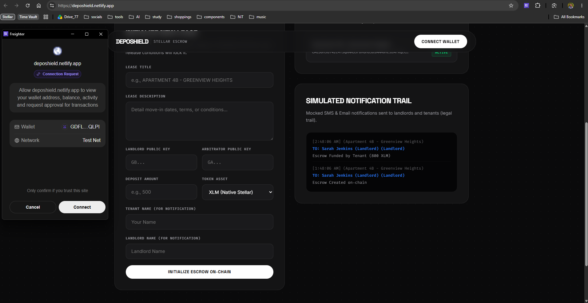
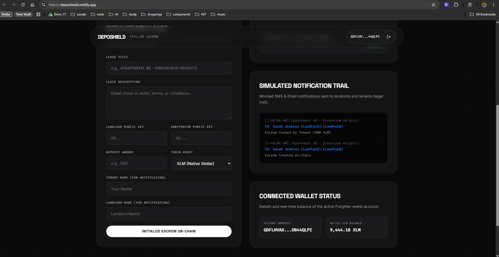
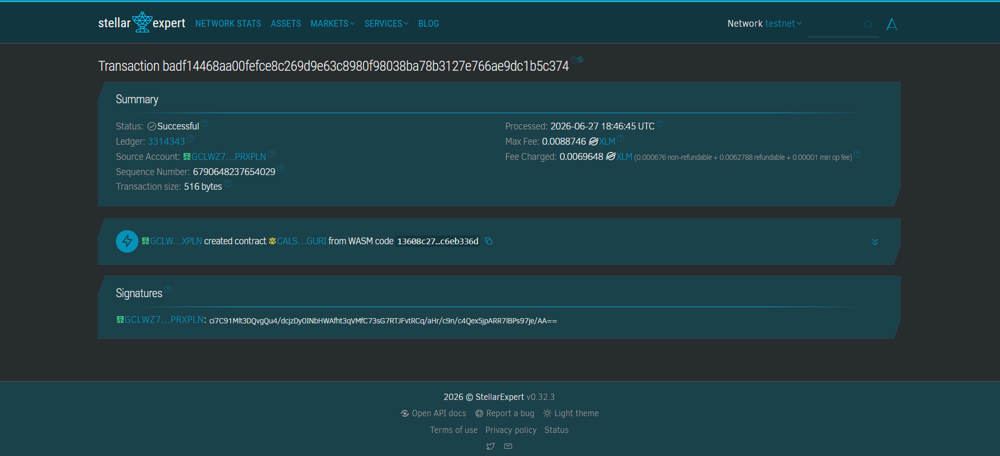
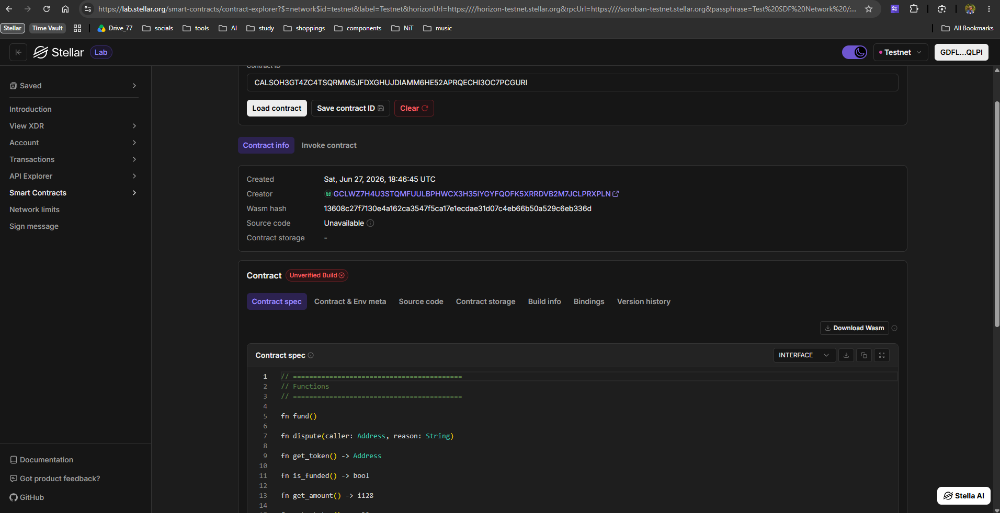
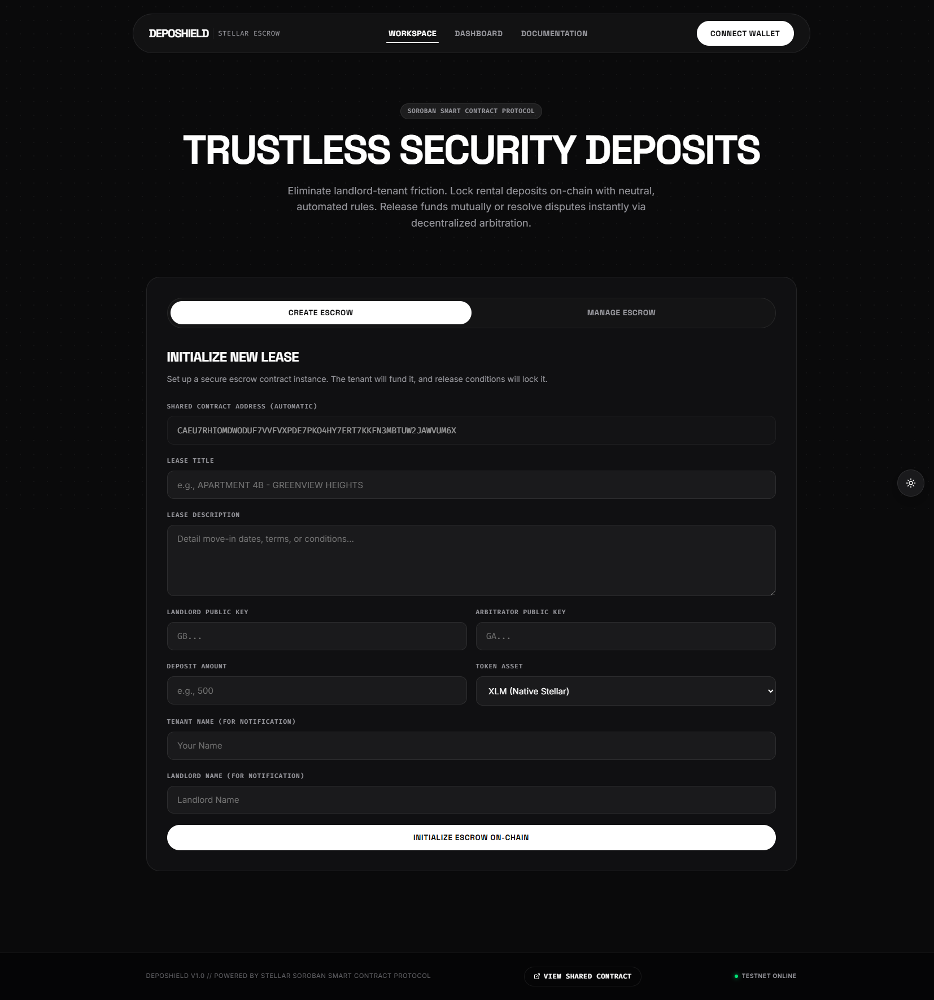
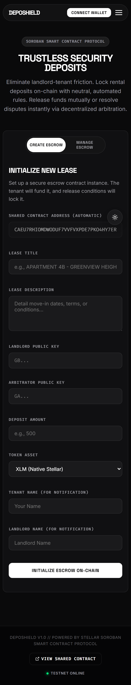
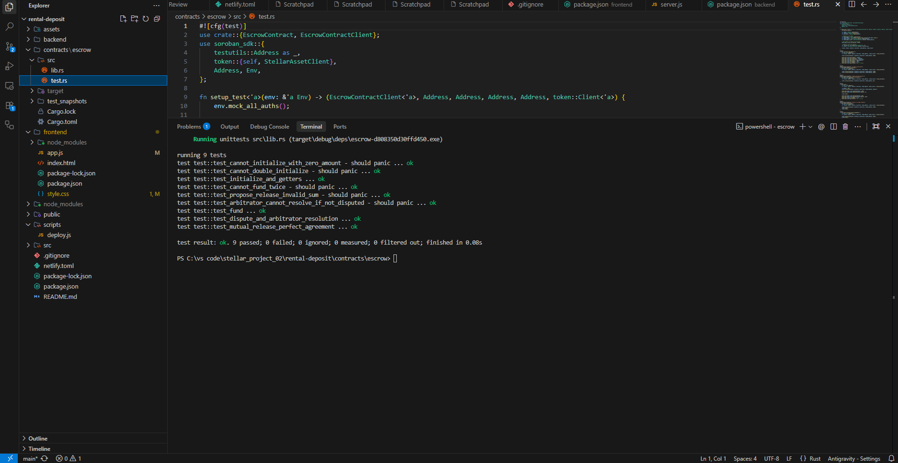
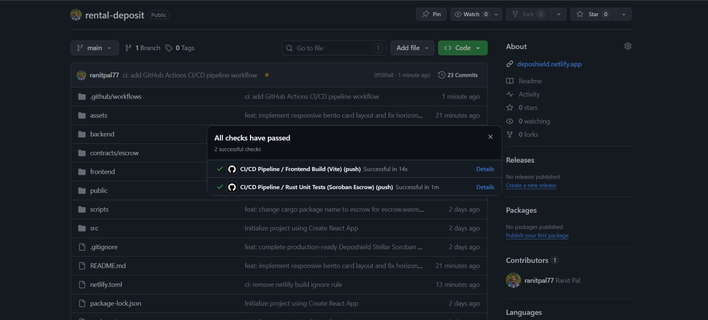
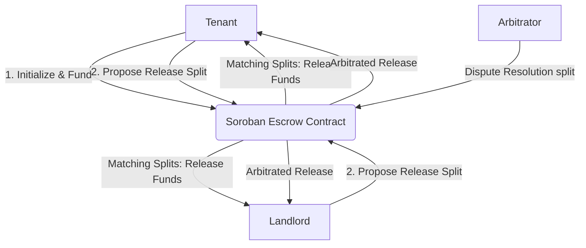

# 🛡️ Deposhield: Trustless Rental Deposit Escrow

[](https://github.com/ranitpal77/rental-deposit/actions/workflows/ci-cd.yml)


## 📖 The Stellar Advantage: Beyond Hand-to-Hand Cash
**Deposhield** is a trustless, decentralized security deposit escrow platform built on the Stellar network using Soroban smart contracts. In informal or emerging rental markets across India, Latin America, and Africa, security deposits represent 1 to 3 months' rent. Handing cash directly to landlords frequently leads to unfair withholding at move-out, while traditional bank escrows are slow, expensive, or unavailable. 

By leveraging Stellar's protocol-level primitives and Soroban's smart contracting, Deposhield provides:
- **🌍 Scalable Parallel Escrows:** Each lease maps to an independent, lightweight contract deployment, eliminating single-party bottleneck risks and scaling to thousands of concurrent agreements.
- **⚡ Fractional Transaction Costs:** Emerging market renters can establish trustless escrows for fractions of a cent, making cryptographic security accessible to anyone.
- **🤝 Cryptographic Dispute Mitigation:** Mutual release logic layers with neutral arbitrator tie-breaker backstops to prevent asset locks, moving trust from humans to code.

---

## 🚀 How It Works
1. **Connect Wallet:** Pairs securely with the Freighter extension.
2. **Initialize Lease:** Tenant enters the deployed contract address, the landlord and arbitrator addresses, the deposit amount, and initializes the agreement.
3. **Lock Deposit (Fund):** Tenant transfers the security deposit on-chain to the contract's secure custody, triggering notifications to both parties.
4. **Mutual Proposal Negotiation:** At move-out, both parties propose split refund proportions. When their proposed splits match on-chain, the contract executes the transfer instantly.
5. **Decentralized Arbitration:** If landlord and tenant disagree, either party declares a dispute. The neutral arbitrator key breaks the tie, releasing the escrowed funds to the designated split.

---

## ✨ Features
- **100% Permissionless Nature:** The core escrow contract operates completely without a central platform operator. Funds are locked by code and can only be released under strict matching rules.
- **Sequential Multi-Party Approval:** Avoids complex browser wallet multi-signature coordination. Users propose splits independently; matching conditions automatically release funds.
- **Arbitration Backstop:** Integrates a neutral third-party arbitrator role (e.g. Delhi Housing Authority or a verified inspector DAO) to act as a cryptographic tie-breaker.
- **Premium Glassmorphic Developer UI:** Sleek, high-contrast dark theme (#0A0A0B default), radial dot-grid texture, and clear monospace technical typography.

---

## 🔗 Deployed Smart Contract Link
**[View on Stellar Lab](https://lab.stellar.org/r/testnet/contract/CALSOH3GT4ZC4TSQRMMSJFDXGHUJDIAMM6HE52APRQECHI3OC7PCGURI)**

---

## 🏦 Developer Wallet
`GD7HBP77O76P6RYMFLZ26J6R74WSHU6DCOFHRFDFYJZ4TZZ2J4E2PWTN`

## 🆔 Deployed Contract ID
`CALSOH3GT4ZC4TSQRMMSJFDXGHUJDIAMM6HE52APRQECHI3OC7PCGURI`

## 🧾 Transaction Hash
`13608c27f7130e4a162ca3547f5ca17e1ecdae31d07c4eb66b50a529c6eb336d`

---

### 📸 Wallet Connected State 


### 📸 Wallet Balance


### 📸 Transaction Screenshot (Successful Testnet Transaction)


### 📸 Deployed Smart Contract Screenshot


### 📸 UI Screenshot


### 📸 Mobile Responsive View


### 📸 Test Output


### 📸 CI/CD Pipeline


---

## 🏗️ Architecture (High-Level Flow)


## 🛣️ Pipeline (Development Plan)

```mermaid
flowchart LR
    subgraph Phase 1: Planning
        A[Define Escrow State & Roles] --> B[Arbitration Tie-breaker Logic]
    end
    subgraph Phase 2: Smart Contracts
        B --> C[Develop Rust Escrow Contract]
        C --> D[Write Comprehensive Unit Tests]
    end
    subgraph Phase 3: Frontend & Backend
        D --> E[Design Glassmorphic UI]
        E --> F[Vite Frontend & Express Metadata Backend]
    end
    subgraph Phase 4: Integration
        F --> G[Freighter Wallet & SDK Connect]
        G --> H[Soroban RPC Integration]
    end
    subgraph Phase 5: Finalization
        H --> I[GitHub Actions CI/CD]
        I --> J[Testnet Contract Deployment]
    end
```


---

## 🛠️ Tech Stack
- **Smart Contract Ecosystem**: Rust, Soroban SDK (v25)
- **Network**: Stellar Testnet
- **App Frontend**: HTML5, CSS3, Vanilla JavaScript (ES6), Vite
- **Wallet Integration**: `@stellar/freighter-api` (latest)
- **Blockchain Interaction API**: `@stellar/stellar-sdk` (latest)
- **Backend Coordinator**: Node.js & Express

---

## 🛠️ Setup & Local Development Guide

Follow these steps to run the complete Deposhield platform locally, compile and test the smart contracts, deploy to the Stellar Testnet, and run the frontend/backend servers.

---

### 📋 Prerequisites

To run this project, you will need the following tools installed on your local machine:

1. **Node.js** (v18.0.0 or higher recommended)
2. **Rust & Cargo** (for compiled Soroban smart contracts)
3. **Rust WASM Target**:
   ```bash
   rustup target add wasm32-unknown-unknown
   ```
4. **Stellar CLI** (v21.0.0 or higher recommended, to compile and deploy contracts):
   ```bash
   cargo install --locked stellar-cli --features opt
   ```
5. **Freighter Wallet Extension** (installed in your Chrome/Firefox/Edge browser). Get it from the [Freighter Website](https://www.freighter.app/).

---

### 💳 1. Freighter Wallet Setup

To test the multi-party interaction (Tenant ↔️ Landlord ↔️ Arbitrator), you should set up three test accounts:

1. Open the Freighter extension and create/import a wallet.
2. In Freighter's settings, switch the network from **Public** to **Testnet** (Settings > Network > Select **Testnet**).
3. Create three separate accounts within Freighter:
   - **Account 1: Tenant** (e.g., `GD7H...`)
   - **Account 2: Landlord** (e.g., `GB54...`)
   - **Account 3: Arbitrator** (e.g., `GAAR...`)
4. Fund all three accounts with Testnet XLM using the **Fund** button in Freighter or via the [Stellar Laboratory Friendbot](https://lab.stellar.org/r/testnet/create-account).

---

### 📦 2. Compile & Test Smart Contracts

The core rental escrow logic is written as a Soroban Rust contract under `contracts/escrow`.

1. **Run Unit Tests**:
   Verify that all 9 smart contract tests compile and pass:
   ```bash
   cd contracts/escrow
   cargo test
   ```
2. **Build WASM Binary**:
   Compile the optimized WebAssembly binary:
   ```bash
   # Run the compilation script from the workspace root directory:
   node scripts/deploy.js
   ```
   This compiles the contract and displays the target WASM path along with instructions to deploy it.

---

### 🚀 3. Deploy Contract to Testnet

To deploy the compiled contract to the Stellar Testnet:

1. Deploy the WASM binary using the Stellar CLI:
   ```bash
   stellar contract deploy \
     --wasm contracts/escrow/target/wasm32-unknown-unknown/release/escrow.wasm \
     --source <YOUR_STELLAR_SECRET_KEY> \
     --network testnet
   ```
   *(Replace `<YOUR_STELLAR_SECRET_KEY>` with the secret key of your Tenant or Developer account)*

2. **Save the Contract ID**:
   The deploy command outputs a unique **Contract ID** (e.g., `CALSOH3GT4ZC4TSQRMMSJFDXGHUJDIAMM6HE52APRQECHI3OC7PCGURI`). Copy this ID; you will use it in the frontend web dashboard.

---

### 🖥️ 4. Start the Services

The workspace contains a placeholder template in the root, but the actual Deposhield dApp components are located in the `backend` and `frontend` folders. Run them in separate terminal instances:

#### A. Start the Backend Coordination Server
The backend coordinates off-chain metadata (lease titles, descriptions, status tracking) and simulates transactional email/SMS notifications to the console.
```bash
# Navigate to the backend folder
cd backend

# Install dependencies
npm install

# Run the backend server
npm start
```
*The backend server will run at `http://localhost:5000`.*

#### B. Start the Frontend Web Dashboard
The frontend is a vanilla JS application built with Vite that connects to Freighter and interacts directly with the Stellar Testnet RPC.
```bash
# Navigate to the frontend folder
cd frontend

# Install dependencies
npm install

# Start the local development server
npm run dev
```
*The web interface will run at `http://localhost:3000`.*

---

### 🔄 5. End-to-End Walkthrough (How to Play)

1. Open **`http://localhost:3000`** in your browser.
2. Click **Connect Wallet** and authorize Freighter. Your active account's address will be shown in the navigation bar.
3. **Step A: Initialize a Lease (Tenant)**
   - Click the **Create Escrow** tab.
   - Enter a **Lease Title** (e.g., "Apartment 5C - City Center") and **Description**.
   - Input the **Landlord Public Key** (Account 2 address) and **Arbitrator Public Key** (Account 3 address).
   - Set the **Deposit Amount** in XLM.
   - Input your **Deployed Contract ID** (from Step 3).
   - Click **Initialize Escrow**. The backend server logs will output a notification alerting the landlord.
4. **Step B: Fund the Escrow (Tenant)**
   - Switch to the **Manage Escrow** tab and search for your Contract ID.
   - Click **Fund Escrow**. Freighter will prompt you to sign the transaction. 
   - Once confirmed on-chain, the status changes to `ACTIVE` and the funds are locked in the smart contract.
5. **Step C: Move-out Splitting Proposals (Tenant & Landlord)**
   - When the lease ends, either party can propose how to split the deposit.
   - Switch accounts in Freighter to act as the Landlord, load the escrow, and use the slider to propose a refund split.
   - Switch accounts back to the Tenant to propose a match.
   - Once both splits match, the funds are instantly released on-chain and sent to both parties.
6. **Step D: Arbitration (Dispute Backstop)**
   - If agreement cannot be reached, the Tenant or Landlord can fill in a reason and click **Declare Dispute**.
   - The status updates to `DISPUTED`.
   - Switch Freighter accounts to the **Arbitrator** (Account 3). The arbitrator interface will appear under the Manage tab.
   - Set the final split slider and click **Resolve Dispute** to release the funds accordingly.

---

## 📂 Project Structure
```text
rental-deposit/
├── contracts/
│   └── escrow/                # Core Soroban Smart Escrow Contract
│       ├── src/
│       │   ├── lib.rs         # The Escrow contract logic
│       │   └── test.rs        # Contract Unit tests
│       └── Cargo.toml         # Rust dependencies & profiles
├── frontend/                  # Vanilla JS Frontend built with Vite
│   ├── index.html             # Main dApp Interface
│   ├── style.css              # Custom styling UI and animations
│   ├── app.js                 # Stellar SDK and Freighter API interactions
│   └── package.json           # Frontend dependencies 
├── backend/                   # Backend Coordinator
│   ├── server.js              # Express app for metadata coordinating
│   └── package.json           # Backend dependencies
├── scripts/                   # Deployment automation scripts
│   └── deploy.js              # Compile helper
├── assets/                    # Brand assets and logo
│   └── logo.png               # Abstract brand logo
└── README.md                  # Project documentation
```

---

## 🔮 Future Enhancements
- **Gas / Fee Sponsorship**: Implement gasless transactions using Stellar fee bumps so emerging market users don't need native XLM balances to lock deposits.
- **Fiat On/Off Ramps**: Integrate MoneyGram and local Stellar Anchor platforms to let non-crypto tenants and landlords deposit and withdraw funds directly in local fiat currencies.
- **Google Auth Integration**: Streamline wallet creation and account management for non-crypto landlords using Google Auth and social logins.

---

## 🌐 Live Demo
[Live demo link](https://deposhield.netlify.app/)

---
