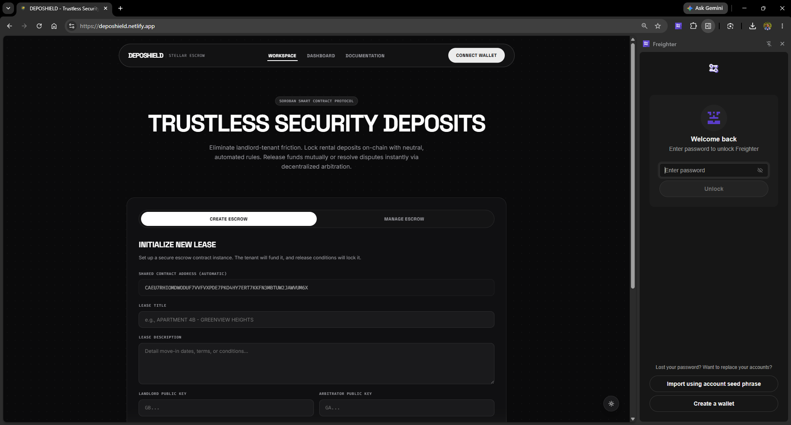
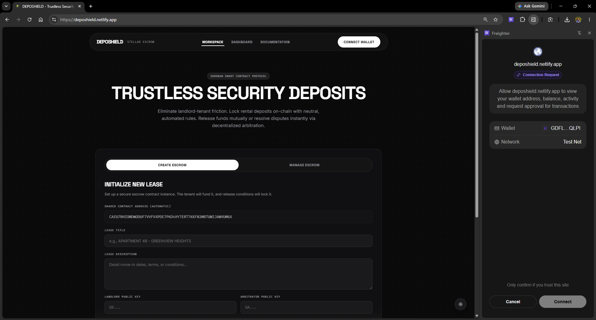
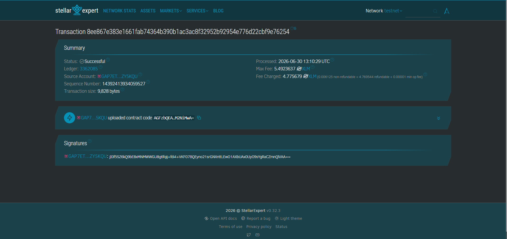
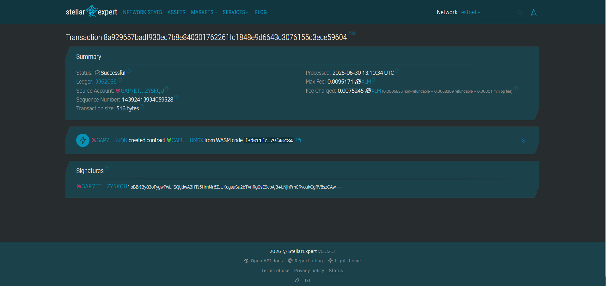
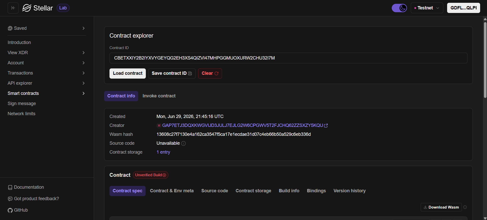
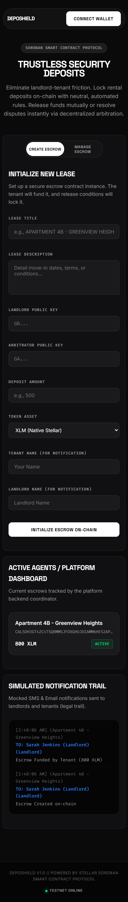
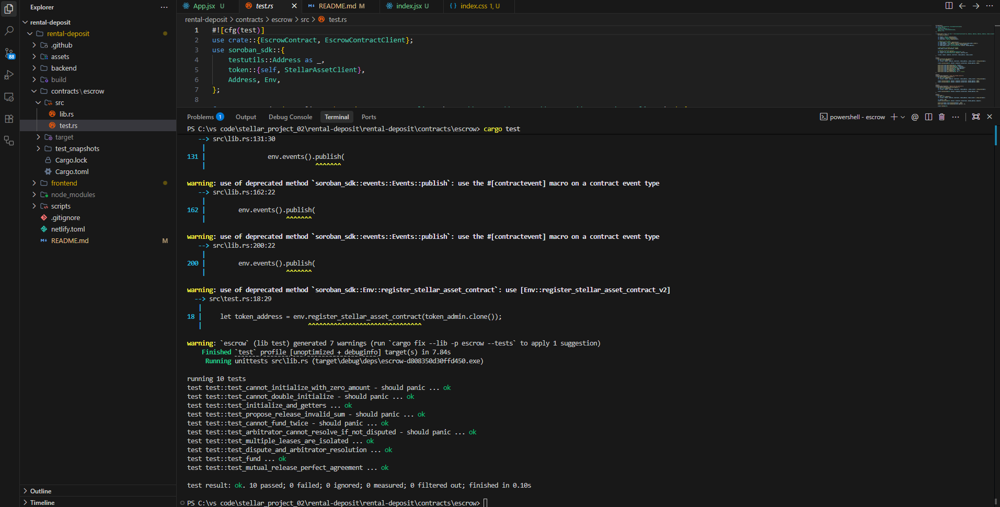
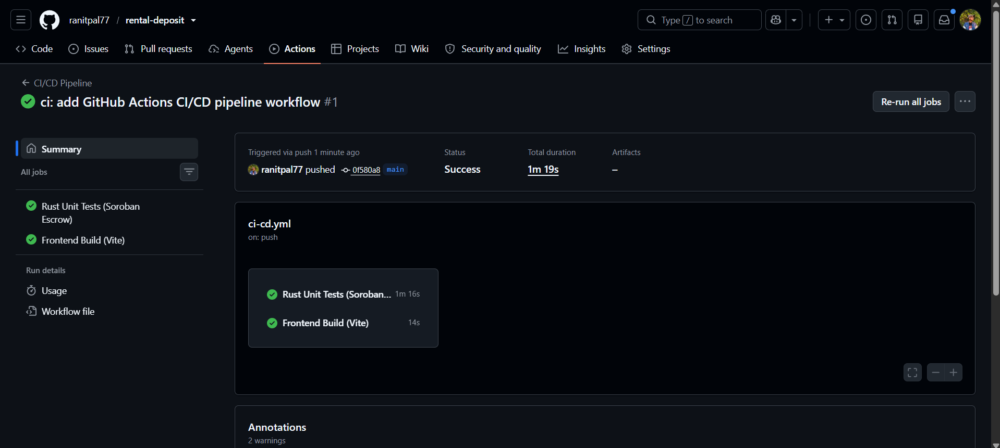
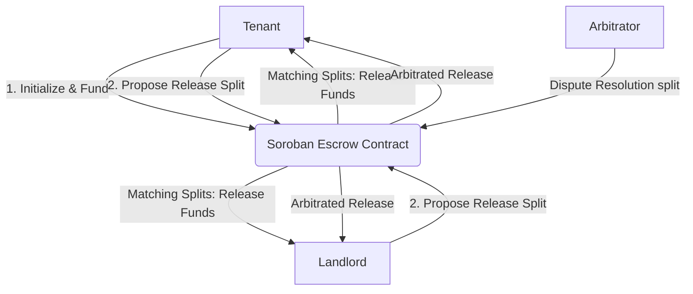

# 🛡️ Deposhield: Trustless Rental Deposit Escrow

[](https://github.com/ranitpal77/rental-deposit/actions/workflows/ci-cd.yml)


## 📖 The Stellar Advantage: Beyond Hand-to-Hand Cash
**Deposhield** is a trustless, decentralized security deposit escrow platform built on the Stellar network using Soroban smart contracts. In informal or emerging rental markets across India, Latin America, and Africa, security deposits represent 1 to 3 months' rent. Handing cash directly to landlords frequently leads to unfair withholding at move-out, while traditional bank escrows are slow, expensive, or unavailable. 

By leveraging Stellar's protocol-level primitives and Soroban's smart contracting, Deposhield provides:
- **🌍 Scalable Parallel Escrows:** Each lease maps to an independent, lightweight contract deployment, eliminating single-party bottleneck risks and scaling to thousands of concurrent agreements.
- **⚡ Fractional Transaction Costs:** Emerging market renters can establish trustless escrows for fractions of a cent, making cryptographic security accessible to anyone.
- **🤝 Cryptographic Dispute Mitigation:** Mutual release logic layers with neutral arbitrator tie-breaker backstops to prevent asset locks, moving trust from humans to code.

---

## 🚀 How It Works
1. **Connect Wallet:** Pairs securely with the Freighter extension.
2. **Initialize Lease:** Tenant enters the deployed contract address, the landlord and arbitrator addresses, the deposit amount, and initializes the agreement.
3. **Lock Deposit (Fund):** Tenant transfers the security deposit on-chain to the contract's secure custody, triggering notifications to both parties.
4. **Mutual Proposal Negotiation:** At move-out, both parties propose split refund proportions. When their proposed splits match on-chain, the contract executes the transfer instantly.
5. **Decentralized Arbitration:** If landlord and tenant disagree, either party declares a dispute. The neutral arbitrator key breaks the tie, releasing the escrowed funds to the designated split.

---

## ✨ Features
- **100% Permissionless Nature:** The core escrow contract operates completely without a central platform operator. Funds are locked by code and can only be released under strict matching rules.
- **Sequential Multi-Party Approval:** Avoids complex browser wallet multi-signature coordination. Users propose splits independently; matching conditions automatically release funds.
- **Arbitration Backstop:** Integrates a neutral third-party arbitrator role (e.g. Delhi Housing Authority or a verified inspector DAO) to act as a cryptographic tie-breaker.
- **Premium Glassmorphic Developer UI:** Sleek, high-contrast dark theme (#0A0A0B default), radial dot-grid texture, and clear monospace technical typography.

---

## 🔗 Deployed Smart Contract Link
**[View on Stellar Lab](https://lab.stellar.org/r/testnet/contract/CAEU7RHIOMDWODUF7VVFVXPDE7PKO4HY7ERT7KKFN3MBTUW2JAWVUM6X)**

**[View on Stellar Expert](https://stellar.expert/explorer/testnet/contract/CAEU7RHIOMDWODUF7VVFVXPDE7PKO4HY7ERT7KKFN3MBTUW2JAWVUM6X)**

---

## 🏦 Developer Wallet
`GDFLHVAXB37QVIPV7LWLEIAPHQ7TYXG36LXX3CHMBFEQA67GDB44QLPI`

## 🆔 Deployed Contract ID
`CAEU7RHIOMDWODUF7VVFVXPDE7PKO4HY7ERT7KKFN3MBTUW2JAWVUM6X`

## 🧾 Transaction Hash
`8a929657badf930ec7b8e840301762261fc1848e9d6643c3076155c3ece59604`

---

### 📸 Wallet Connected State 



### 📸 Wallet Balance


### 📸 Transaction Screenshot (Successful Testnet Transaction)



### 📸 Deployed Smart Contract Screenshot


### 📸 UI Screenshot


### 📸 Mobile Responsive View


### 📸 Test Output


### 📸 CI/CD Pipeline



---

## 🏗️ Architecture (High-Level Flow)


## 🛣️ Pipeline (Development Plan)

```mermaid
flowchart LR
    subgraph Phase 1: Planning
        A[Define Escrow State & Roles] --> B[Arbitration Tie-breaker Logic]
    end
    subgraph Phase 2: Smart Contracts
        B --> C[Develop Rust Escrow Contract]
        C --> D[Write Comprehensive Unit Tests]
    end
    subgraph Phase 3: Frontend & Backend
        D --> E[Design Glassmorphic UI]
        E --> F[Vite Frontend & Express Metadata Backend]
    end
    subgraph Phase 4: Integration
        F --> G[Freighter Wallet & SDK Connect]
        G --> H[Soroban RPC Integration]
    end
    subgraph Phase 5: Finalization
        H --> I[GitHub Actions CI/CD]
        I --> J[Testnet Contract Deployment]
    end
```


---

## 🛠️ Tech Stack
- **Smart Contract Ecosystem**: Rust, Soroban SDK (v25)
- **Network**: Stellar Testnet
- **App Frontend**: React, Vanilla CSS, Vite
- **Wallet Integration**: `@stellar/freighter-api` (latest)
- **Blockchain Interaction API**: `@stellar/stellar-sdk` (latest)
- **Backend Coordinator**: Node.js & Express

---

## 🛠️ Setup & Local Development Guide

Follow these steps to run the complete Deposhield platform locally, compile and test the smart contracts, deploy to the Stellar Testnet, and run the frontend/backend servers.

---

### 📋 Prerequisites

To run this project, you will need the following tools installed on your local machine:

1. **Node.js** (v18.0.0 or higher recommended)
2. **Rust & Cargo** (for compiled Soroban smart contracts)
3. **Rust WASM Target**:
   ```bash
   rustup target add wasm32-unknown-unknown
   ```
4. **Stellar CLI** (v21.0.0 or higher recommended, to compile and deploy contracts):
   ```bash
   cargo install --locked stellar-cli --features opt
   ```
5. **Freighter Wallet Extension** (installed in your Chrome/Firefox/Edge browser). Get it from the [Freighter Website](https://www.freighter.app/).

---

### 💳 1. Freighter Wallet Setup

To test the multi-party interaction (Tenant ↔️ Landlord ↔️ Arbitrator), you should set up three test accounts:

1. Open the Freighter extension and create/import a wallet.
2. In Freighter's settings, switch the network from **Public** to **Testnet** (Settings > Network > Select **Testnet**).
3. Create three separate accounts within Freighter:
   - **Account 1: Tenant** (e.g., `GD7H...`)
   - **Account 2: Landlord** (e.g., `GB54...`)
   - **Account 3: Arbitrator** (e.g., `GAAR...`)
4. Fund all three accounts with Testnet XLM using the **Fund** button in Freighter or via the [Stellar Laboratory Friendbot](https://lab.stellar.org/r/testnet/create-account).

---

### 📦 2. Compile & Test Smart Contracts

The core rental escrow logic is written as a Soroban Rust contract under `contracts/escrow`.

1. **Run Unit Tests**:
   Verify that all 9 smart contract tests compile and pass:
   ```bash
   cd contracts/escrow
   cargo test
   ```
2. **Build WASM Binary**:
   Compile the optimized WebAssembly binary:
   ```bash
   # Run the compilation script from the workspace root directory:
   node scripts/deploy.js
   ```
   This compiles the contract and displays the target WASM path along with instructions to deploy it.

---

### 🚀 3. Deploy Contract to Testnet

To deploy the compiled contract to the Stellar Testnet:

1. Deploy the WASM binary using the Stellar CLI:
   ```bash
   stellar contract deploy \
     --wasm contracts/escrow/target/wasm32-unknown-unknown/release/escrow.wasm \
     --source <YOUR_STELLAR_SECRET_KEY> \
     --network testnet
   ```
   *(Replace `<YOUR_STELLAR_SECRET_KEY>` with the secret key of your Tenant or Developer account)*

2. **Save the Contract ID**:
   The deploy command outputs a unique **Contract ID** (e.g., `CALSOH3GT4ZC4TSQRMMSJFDXGHUJDIAMM6HE52APRQECHI3OC7PCGURI`). Copy this ID; you will use it in the frontend web dashboard.

---

### 🖥️ 4. Start the Services

The Deposhield dApp components are located in the `backend` and `frontend` folders. Run them in separate terminal instances:

#### A. Start the Backend Coordination Server
The backend coordinates off-chain metadata (lease titles, descriptions, status tracking) and simulates transactional email/SMS notifications to the console.
```bash
# Navigate to the backend folder
cd backend

# Install dependencies
npm install

# Run the backend server
npm start
```
*The backend server will run at `http://localhost:5000`.*

#### B. Start the Frontend Web Dashboard
The frontend is a React application built with Vite that connects to Freighter and interacts directly with the Stellar Testnet RPC.
```bash
# Navigate to the frontend folder
cd frontend

# Install dependencies
npm install

# Start the local development server
npm run dev
```
*The web interface will run at `http://localhost:3000`.*

---

### 🔄 5. End-to-End Walkthrough (How to Play)

Open **`http://localhost:3000`** in your browser. Click **Connect Wallet** and authorize Freighter. Your active account's address will be shown in the navigation bar.

#### 🏁 Core Escrow Setup (Common to Both Examples)
1. **Initialize Lease (as Tenant - Account 1):**
   - Click the **Create Escrow** tab.
   - Enter a title (e.g. "Apartment 4B - Greenview Heights") and description.
   - Enter the Landlord address (Account 2) and Arbitrator address (Account 3).
   - Input the deposit amount (e.g. `100 XLM`).
   - Click **INITIALIZE ESCROW ON-CHAIN** and sign the Freighter transaction. 
   - Copy the generated **Lease ID** from the green success toast notification (e.g., `8172930419203810`).
2. **Fund Escrow (as Tenant - Account 1):**
   - Switch to the **Manage Escrow** tab, paste the **Lease ID**, and click **LOAD**.
   - Click **FUND ESCROW NOW (DEPOSIT)** and approve the transaction in Freighter.
   - Once completed, the status changes to `ACTIVE / LOCKED`.

---

#### 🤝 EXAMPLE 1: Mutual Release Agreement (No Arbitrator/Account 3 Needed)
*This example demonstrates a peaceful move-out where tenant and landlord coordinate splits directly.*

1. **Tenant Proposes Split (as Tenant - Account 1):**
   - Under **PROPOSE RELEASE SPLIT**, drag the slider to **TO TENANT: 75 XLM** and **TO LANDLORD: 25 XLM** (meaning: the Tenant requests 75 XLM back, leaving 25 XLM for paint/repairs).
   - Click **SUBMIT RELEASE PROPOSAL** and sign.
   - The status remains `ACTIVE / LOCKED` and a banner states: `"Waiting for other party..."` (multiple submissions are locked for this account).
2. **Landlord Reconnects (as Landlord - Account 2):**
   - Switch your Freighter account to **Account 2**.
   - Click **CONNECT WALLET** at the top of the website so it registers the Landlord address.
   - Go to **MANAGE ESCROW** and load the same **Lease ID**.
   - The interface shows: `"Offer Received: Tenant proposed: Tenant 75 XLM / Landlord 25 XLM."` The slider automatically snaps to 75/25.
3. **Landlord Confirms split:**
   - Leave the slider at the snapped 75/25 split.
   - Click **SUBMIT RELEASE PROPOSAL** and sign.
   - **Payout:** Contract detects matching proposals, executes payouts immediately (75 XLM to Account 1, 25 XLM to Account 2), and sets status to `RELEASED / RESOLVED SUCCESSFULLY`.

---

#### ⚖️ EXAMPLE 2: Disputed Settlement (Arbitrator/Account 3 Resolves Split)
*This example demonstrates a conflict where landlord and tenant cannot agree, requiring the arbitrator to divide funds.*

1. **Setup & Fund:**
   - Repeat the **Core Escrow Setup** steps above to initialize and fund a new lease of `100 XLM`.
2. **Conflicting splits:**
   - **Tenant Proposes (Account 1):** Tenant loads the Lease ID, drags slider to **90/10**, and submits.
   - **Landlord Proposes (Account 2):** Landlord reconnects, loads same Lease ID, drags slider to **30/70**, and submits.
   - **Conflict State:** Since proposals conflict (90/10 vs 30/70), status remains `ACTIVE / LOCKED`, the sliders lock, and a red warning banner lists both conflicting proposals.
3. **Raise a Dispute:**
   - Under **RAISE DISPUTE**, Tenant or Landlord types a reason (e.g. "Landlord claiming painting damages that do not exist") and clicks **RAISE DISPUTE**.
   - On-chain status locks to **DISPUTED**.
4. **Arbitrator Verdict (as Arbitrator - Account 3):**
   - Switch Freighter account to **Account 3** (Arbitrator).
   - Click **CONNECT WALLET** at the top of the website.
   - Go to **MANAGE ESCROW** and load the **Lease ID**.
   - The Arbitrator-only decision panel reveals showing the dispute reason.
   - Set the final split (e.g. **TO TENANT: 60 XLM** / **TO LANDLORD: 40 XLM**) and click **EXECUTE ARBITRATOR RESOLUTION**.
   - **Payout:** The contract transfers the designated splits (60 XLM to Account 1, 40 XLM to Account 2) and resolves the escrow.

---

## 📂 Project Structure
```text
rental-deposit/
├── contracts/
│   └── escrow/                # Core Soroban Smart Escrow Contract
│       ├── src/
│       │   ├── lib.rs         # The Escrow contract logic
│       │   └── test.rs        # Contract Unit tests
│       └── Cargo.toml         # Rust dependencies & profiles
├── frontend/                  # React Frontend built with Vite
│   ├── index.html             # Main index mount file
│   ├── vite.config.js         # Vite configuration
│   ├── package.json           # Frontend dependencies 
│   └── src/                   # React components and styling
│       ├── App.jsx            # Main wallet-integrated React dApp logic
│       ├── index.jsx          # React app mount file
│       └── index.css          # Premium stylesheet
├── backend/                   # Backend Coordinator
│   ├── server.js              # Express app for metadata coordinating
│   └── package.json           # Backend dependencies
├── scripts/                   # Deployment automation scripts
│   └── deploy.js              # Compile helper
├── assets/                    # Brand assets and logo
│   └── logo.png               # Abstract brand logo
└── README.md                  # Project documentation
```

---

## 🔮 Future Enhancements
- **Gas / Fee Sponsorship**: Implement gasless transactions using Stellar fee bumps so emerging market users don't need native XLM balances to lock deposits.
- **Fiat On/Off Ramps**: Integrate MoneyGram and local Stellar Anchor platforms to let non-crypto tenants and landlords deposit and withdraw funds directly in local fiat currencies.
- **Google Auth Integration**: Streamline wallet creation and account management for non-crypto landlords using Google Auth and social logins.

---

## 🌐 Live Site
[Live demo link](https://deposhield.netlify.app/)

---

## 🌐 Live Demo
[Demo video 01](./assets/demo-video-01.mp4) (Tanante & Landlord)


[Demo video 02](./assets/demo-video-02.mp4) (Tanante & Landlord & Arbitrator)


---