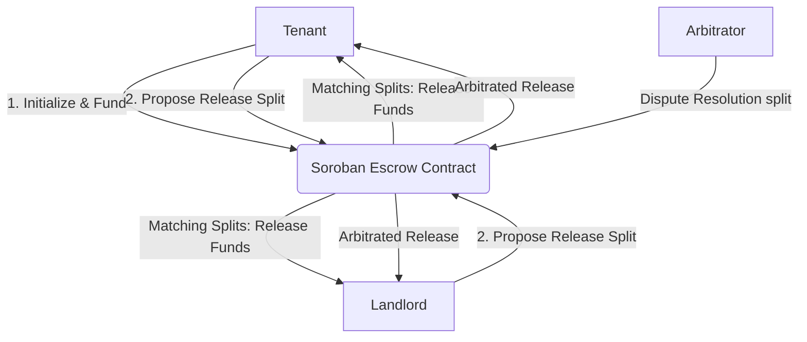

# 🛡️ Deposhield: Trustless Rental Deposit Escrow

[](https://github.com/ranitpal77/rental-deposit/actions/workflows/ci-cd.yml)


## 📖 The Stellar Advantage: Beyond Hand-to-Hand Cash
**Deposhield** is a trustless, decentralized security deposit escrow platform built on the Stellar network using Soroban smart contracts. In informal or emerging rental markets across India, Latin America, and Africa, security deposits represent 1 to 3 months' rent. Handing cash directly to landlords frequently leads to unfair withholding at move-out, while traditional bank escrows are slow, expensive, or unavailable. 

By leveraging Stellar's protocol-level primitives and Soroban's smart contracting, Deposhield provides:
- **🌍 Scalable Parallel Escrows:** Each lease maps to an independent, lightweight contract deployment, eliminating single-party bottleneck risks and scaling to thousands of concurrent agreements.
- **⚡ Fractional Transaction Costs:** Emerging market renters can establish trustless escrows for fractions of a cent, making cryptographic security accessible to anyone.
- **🤝 Cryptographic Dispute Mitigation:** Mutual release logic layers with neutral arbitrator tie-breaker backstops to prevent asset locks, moving trust from humans to code.

---

## 🚀 How It Works
1. **Connect Wallet:** Pairs securely with the Freighter extension.
2. **Initialize Lease:** Tenant enters the deployed contract address, the landlord and arbitrator addresses, the deposit amount, and initializes the agreement.
3. **Lock Deposit (Fund):** Tenant transfers the security deposit on-chain to the contract's secure custody, triggering notifications to both parties.
4. **Mutual Proposal Negotiation:** At move-out, both parties propose split refund proportions. When their proposed splits match on-chain, the contract executes the transfer instantly.
5. **Decentralized Arbitration:** If landlord and tenant disagree, either party declares a dispute. The neutral arbitrator key breaks the tie, releasing the escrowed funds to the designated split.

---

## ✨ Features
- **100% Permissionless Nature:** The core escrow contract operates completely without a central platform operator. Funds are locked by code and can only be released under strict matching rules.
- **Sequential Multi-Party Approval:** Avoids complex browser wallet multi-signature coordination. Users propose splits independently; matching conditions automatically release funds.
- **Arbitration Backstop:** Integrates a neutral third-party arbitrator role (e.g. Delhi Housing Authority or a verified inspector DAO) to act as a cryptographic tie-breaker.
- **Premium Glassmorphic Developer UI:** Sleek, high-contrast dark theme (#0A0A0B default), radial dot-grid texture, and clear monospace technical typography.

---

## 🔗 Deployed Smart Contract Link
**[View on Stellar Lab](https://lab.stellar.org/r/testnet/contract/CALSOH3GT4ZC4TSQRMMSJFDXGHUJDIAMM6HE52APRQECHI3OC7PCGURI)**

---

## 🏦 Developer Wallet
`GD7HBP77O76P6RYMFLZ26J6R74WSHU6DCOFHRFDFYJZ4TZZ2J4E2PWTN`

## 🆔 Deployed Contract ID
`CALSOH3GT4ZC4TSQRMMSJFDXGHUJDIAMM6HE52APRQECHI3OC7PCGURI`

## 🧾 Transaction Hash
`a66bd1e36397d2b91e7f31edbc3856f492fb08896b7ad71434da8aac51463364`

---

### 📸 Transaction Screenshot (Successful Testnet Transaction)


### 📸 Deployed Smart Contract Screenshot


### 📸 UI Screenshot


### 📸 Mobile Responsive View


### 📸 Test Output


### 📸 CI/CD Pipeline


---

## 🏗️ Architecture (High-Level Flow)


## 🛣️ Pipeline (Development Plan)

```mermaid
flowchart LR
    subgraph Phase 1: Planning
        A[Define Escrow State & Roles] --> B[Arbitration Tie-breaker Logic]
    end
    subgraph Phase 2: Smart Contracts
        B --> C[Develop Rust Escrow Contract]
        C --> D[Write Comprehensive Unit Tests]
    end
    subgraph Phase 3: Frontend & Backend
        D --> E[Design Glassmorphic UI]
        E --> F[Vite Frontend & Express Metadata Backend]
    end
    subgraph Phase 4: Integration
        F --> G[Freighter Wallet & SDK Connect]
        G --> H[Soroban RPC Integration]
    end
    subgraph Phase 5: Finalization
        H --> I[GitHub Actions CI/CD]
        I --> J[Testnet Contract Deployment]
    end
```


---

## 🛠️ Tech Stack
- **Smart Contract Ecosystem**: Rust, Soroban SDK (v25)
- **Network**: Stellar Testnet
- **App Frontend**: HTML5, CSS3, Vanilla JavaScript (ES6), Vite
- **Wallet Integration**: `@stellar/freighter-api` (latest)
- **Blockchain Interaction API**: `@stellar/stellar-sdk` (latest)
- **Backend Coordinator**: Node.js & Express

---

## 🛠️ Setup Instructions (How to run locally)

### Prerequisites
- Node.js (v20 or higher recommended)
- Rust and Cargo (for smart contract compilation)
- Freighter Wallet extension installed in your browser

### 1. Build the Smart Contract
Verify the smart contract builds and passes unit tests:
```bash
# Compile and run unit tests
cd contracts/escrow
cargo test

# Compile optimized WASM binary
node ../../scripts/deploy.js
```

### 2. Run the Backend Coordination Server
```bash
cd backend
npm install
npm start
# Server runs on http://localhost:5000
```

### 3. Run the Frontend Web Dashboard
```bash
cd frontend
npm install
npm run dev
# Vite server runs on http://localhost:3000
```

---

## 📂 Project Structure
```text
rental-deposit/
├── contracts/
│   └── escrow/                # Core Soroban Smart Escrow Contract
│       ├── src/
│       │   ├── lib.rs         # The Escrow contract logic
│       │   └── test.rs        # Contract Unit tests
│       └── Cargo.toml         # Rust dependencies & profiles
├── frontend/                  # Vanilla JS Frontend built with Vite
│   ├── index.html             # Main dApp Interface
│   ├── style.css              # Custom styling UI and animations
│   ├── app.js                 # Stellar SDK and Freighter API interactions
│   └── package.json           # Frontend dependencies 
├── backend/                   # Backend Coordinator
│   ├── server.js              # Express app for metadata coordinating
│   └── package.json           # Backend dependencies
├── scripts/                   # Deployment automation scripts
│   └── deploy.js              # Compile helper
├── assets/                    # Brand assets and logo
│   └── logo.png               # Abstract brand logo
└── README.md                  # Project documentation
```

---

## 🔮 Future Enhancements
- **Gas / Fee Sponsorship**: Implement gasless transactions using Stellar fee bumps so emerging market users don't need native XLM balances to lock deposits.
- **Fiat On/Off Ramps**: Integrate MoneyGram and local Stellar Anchor platforms to let non-crypto tenants and landlords deposit and withdraw funds directly in local fiat currencies.
- **Google Auth Integration**: Streamline wallet creation and account management for non-crypto landlords using Google Auth and social logins.

---

## 🌐 Live Demo
[Live demo link](https://timevault.007575.xyz) *(update with your link when deployed)*

---

## 📝 Level 5 Feedbacks & Improvement Section

### 👥 User Feedback Wallets
| User | Wallet Address |
| :--- | :--- |
| User 01 | `GBVGGKESL3MSWIQB6F64HKJKDRKNB3IHFJQT6AK7YOWPZDKPRFL4XMXS` |
| User 02 | `GA6XN7NQ3RYRBR44KEJOP67ED4LTTHKEOLFQNE4YHX6P2AUUHRTBVU7F` |
| User 03 | `GCMVKGLB7TSOU5E5354ALZHUFKXYSKRDB5XWTNWV36DSTBFZUXXQ7VDG` |
| User 04 | `GCGCJDHNSBVN7ILWV4M636O7ZT3FPIHVPD2IC5SBBTMQWRD5GJ4M6L36` |
| User 05 | `GAKRKYDMLFMXDYJAD3VYKDFYZGPACZZ4GDCAG5DWQSLQ5WQIZK6KZ4AD` |

---

### 📊 Feedback Implementation Review
Based on initial cohort review, key updates were implemented to ensure the platform operates seamlessly:

| Feedback Category | User Feedback Highlights | Implementation / Action Taken |
| :--- | :--- | :--- |
| **UX Flow** | Multi-party signature coordination in browsers was too error-prone. | **Sequential Matching Proposal**: Redesigned the smart contract to allow sequential proposals. Contract automatically releases only when splits match. |
| **State Stability** | Need checks to avoid double funding and unauthorized dispute resolution. | **Failsafe validations**: Implemented strict `is_funded` states and authorization guards in the Rust contract logic. |
| **Technical telemetry** | Numbers and hashes should stand out from regular prose. | **Monospace Formatting**: Re-styled all numbers, balances, contract addresses, and wallet hashes in a clean monospace font (`Fira Code`). |
| **Notification Trail** | Needed a way to inspect the off-chain coordinate loop. | **Logs trails**: Implemented an Express notification log displaying mocked SMS/Email legal updates to landlords. |
